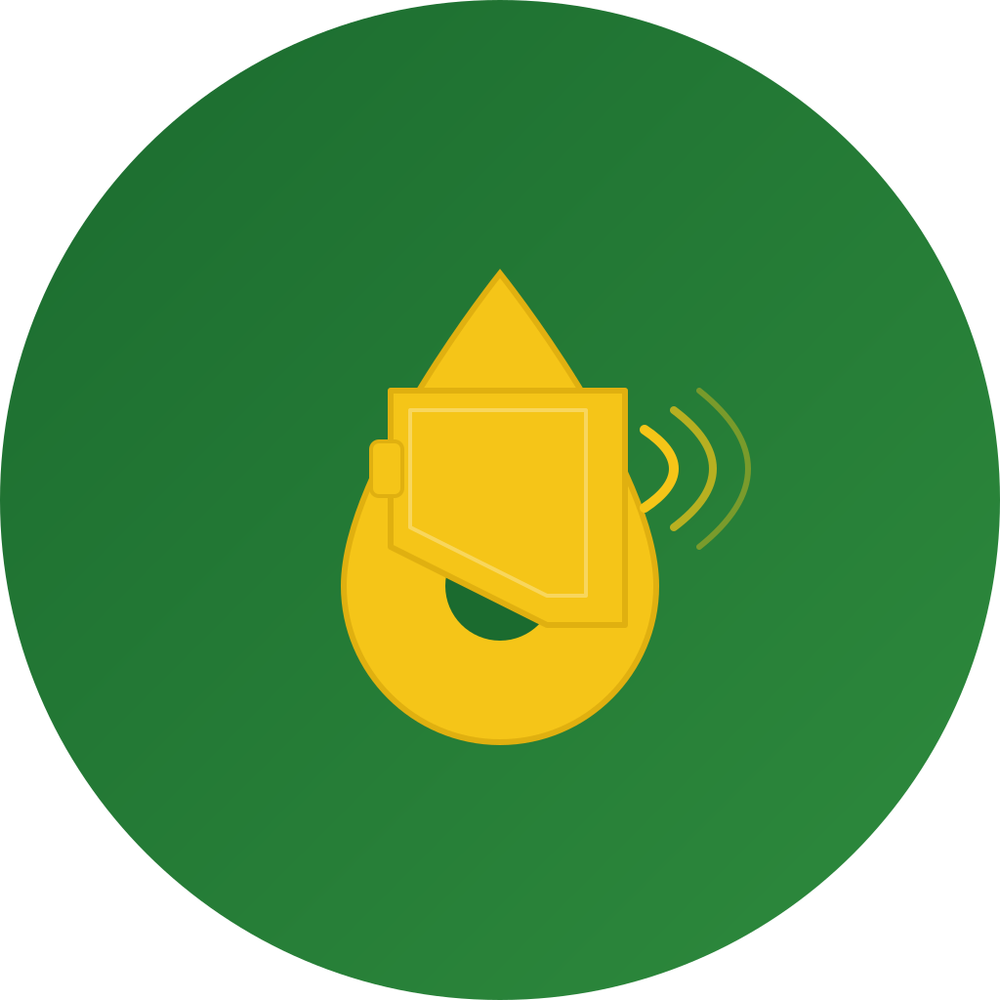

<p align="center">
  
</p>

<h1 align="center">بلّغ — Baligh</h1>
<p align="center">
  <strong>Civic Reporting Platform for Mauritania</strong>
  <br>
  <em>Signalement citoyen · تقرير المواطن · Citizen Reporting</em>
</p>

<p align="center">
  
  
  
  
  
</p>

---

## Overview

**Baligh** (بلّغ — "Report" in Arabic) is a cross-platform citizen reporting application built for Mauritania. Citizens can report local issues (infrastructure damage, environmental hazards, security concerns, etc.), browse reports submitted by others, verify credibility through voting, and communicate directly with reporters.

The app is built with **Flutter** (MVC architecture, Provider state management) and backed by **Supabase** (PostgreSQL, Auth, Storage, Realtime).

---

## Features

### Core
- **Report submission** — 4-step wizard: category → description → photo → review & submit
- **Interactive map** — OSM tiles with FMTC caching, category-colored markers, search & filter
- **Home feed** — Animated report cards, search bar, stats bar, category filter chips
- **Credibility system** — Confirm/reject voting with real-time count updates
- **Real-time messaging** — Per-report conversations with Supabase Realtime subscription & unread badges
- **Notifications** — DB-backed alert system with unread count

### User
- **Authentication** — Supabase email/password with auto session persistence
- **My Reports** — Edit/delete own reports, filter by status
- **Account** — Profile stats (submitted/validated), reputation badge, settings access
- **Multilingual** — Arabic (RTL), French, English with persisted locale choice
- **Theming** — Light/Dark/System with Material 3, brand colors (green #2E7D32, yellow #FDD835)

### Admin
- **Web dashboard** — Standalone HTML/JS page deployed on Vercel
- **Manage reports** — Filter, change status, delete
- **Manage users** — View stats, toggle admin role, delete
- **Analytics** — Category bar chart via Chart.js

---

## Tech Stack

| Layer | Technology |
|-------|-----------|
| **Frontend** | Flutter 3.3+ (Dart 3.x) |
| **State** | Provider + ChangeNotifier |
| **Backend** | Supabase (PostgreSQL, Auth, Storage, Realtime) |
| **Maps** | flutter_map + OpenStreetMap + FMTC tile caching |
| **i18n** | flutter_localizations + intl + ARB files (3 locales) |
| **Fonts** | Google Fonts — Cairo (Arabic) |
| **Admin** | Vanilla HTML/CSS/JS + Supabase JS SDK |
| **Hosting (Admin)** | Vercel |

---

## Project Architecture

```
lib/
├── main.dart                    # Entry point, providers, theme definitions
├── core/
│   ├── database/                # Supabase DAOs (user, report, vote, notification, message)
│   ├── models/                  # Data models (user, vote, notification, message)
│   └── services/                # Service implementations (auth, report, notification, location)
├── models/                      # ReportModel
├── services/                    # Abstract service interfaces
├── controllers/                 # ChangeNotifier providers (9 total)
├── views/                       # UI screens (13 views)
├── widgets/                     # Shared widgets (report_card, empty_state)
└── l10n/                        # Localization (ARB + generated Dart files)
```

### Architectural Pattern: **MVC-inspired + Service Layer**
- **Models** — Plain Dart classes with `toMap()`/`fromMap()` serialization
- **Views** — StatelessWidgets consuming providers via `context.watch`/`Selector`/`Consumer`
- **Controllers (Providers)** — ChangeNotifier classes holding state and business logic
- **Services** — Abstract interfaces (e.g., `ReportService`) with Supabase-backed implementations (`ReportServiceDb`)
- **DAOs** — Data access objects encapsulating Supabase queries with typed parameters

---

## Screenshots

| | | |
|---|---|---|
| *(screenshot placeholder)* | *(screenshot placeholder)* | *(screenshot placeholder)* |
| Splash / Login | Home Feed | Report Detail |

| | | |
|---|---|---|
| *(screenshot placeholder)* | *(screenshot placeholder)* | *(screenshot placeholder)* |
| Map View | New Report Wizard | Chat |

---

## Getting Started

### Prerequisites

- Flutter SDK 3.3+ ([install guide](https://docs.flutter.dev/get-started/install))
- A Supabase project ([create one free](https://supabase.com/dashboard/projects))
- Android SDK / Xcode for device build

### Setup

1. **Clone the repository**
   ```bash
   git clone https://github.com/your-org/baligh-app.git
   cd baligh-app
   ```

2. **Install dependencies**
   ```bash
   flutter pub get
   ```

3. **Configure Supabase**
   Create `lib/utils/supabase_config.dart`:
   ```dart
   import 'package:supabase_flutter/supabase_flutter.dart';

   class SupabaseConfig {
     static final client = Supabase.instance.client;
   }
   ```
   Then set your Supabase URL and anon key in `main.dart`:
   ```dart
   await Supabase.initialize(
     url: 'https://your-project.supabase.co',
     anonKey: 'your-anon-key',
   );
   ```

4. **Run database migration**
   Copy the contents of `supabase_migration.sql` and execute it in your Supabase SQL Editor. This creates all tables, RLS policies, storage buckets, and the `update_vote_counts` RPC function.

5. **Run the app**
   ```bash
   flutter run
   ```

### Build for Release

```bash
flutter build apk --release   # Android
flutter build ios --release   # iOS (macOS only)
```

---

## Database Schema

| Table | Purpose |
|-------|---------|
| `users` | Extended user profiles (username, avatar, reputation) |
| `reports` | Citizen reports (category, description, location, photo, confirm/deny counts, status) |
| `votes` | Credibility votes (user_id, report_id, vote_type) |
| `notifications` | Per-user alerts (type, message, is_read) |
| `messages` | Per-report chat messages (sender, receiver, content, is_read) |

RLS policies enforce: users can only modify their own data; admins have full access; vote count updates use a `SECURITY DEFINER` RPC to bypass row-level restrictions on the reports table.

---

## Localization

Baligh supports **3 languages**:

| Language | Code | Direction | Status |
|----------|------|-----------|--------|
| العربية (Arabic) | `ar` | RTL | ✅ Full |
| Français (French) | `fr` | LTR | ✅ Full |
| English | `en` | LTR | ✅ Full |

Locale is persisted via `SharedPreferences` and applied at the `MaterialApp` level with a `ValueKey` to force full tree rebuild on switch.

---

## Admin Dashboard

A standalone web dashboard is available at `admin-dashboard/`. It connects directly to your Supabase project:

```bash
cd admin-dashboard
# Update supabaseUrl and supabaseAnonKey in index.html
# Deploy to Vercel, Netlify, or any static host
```

Features: login, report management (filter, status change, delete), user management, notification viewer, reports-by-category chart.

---

## Team

| Member | Role |
|--------|------|
| [Ahmed Abdy](https://github.com/ahmedou24157) | Developer |
| [Abdsalam](https://github.com/Abdsalam-hub) | Developer |
| [Mohameden](https://github.com/mohameden19961) | Developer |
| [Hasseen Salem](https://github.com/hasseen-salem) | Developer |

---

## License

This project is licensed under the MIT License — see the LICENSE file for details.

---

<p align="center">
  <strong>بلّغ</strong> — <em>Because every voice matters.</em>
  <br>
  <sub>Built with ♥ for Mauritania</sub>
</p>
